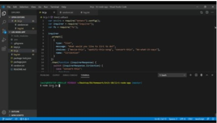

# liri-node-app

### Overview

Welcome to the liri-node-app.  The liri-node app is a command line node app that uses to take user's parameters and searchs for songs, movies and concerts using various node package managers.  

### How it works

When liri.js is ran in the command line, the inquirer npm prompts the user to choose between four different commands: movie-this,spotify-this-song, concert-this and do-what-it says.  When choosing any action but do-what-it-says the user is then prompted to input a title for which they would like to search.  When choosing do-what-it-says the user is then prompted to choose between movie-this, spotify-this-song and concert this without being able to input a title they would like search for but is predetermined. All data that is logged to the console is also appended to the text file log.txt.

#### movie-this

Using the Axios npm, movie-this searches the Open Movie Database API for the title that best matches the users input.  It then returns:

* Movie title
* Year of release
* IMDB rating
* Rotten Tomatoes rating
* Country of origin
* Languages
* Actors

If a the prompt for a movie title is left blank, movie-this defaults to the movie "Mr.Nobody"

#### spotify-this-song

Using the Node-Spotify-API, spotify-this-song searches for song title that best matches the users input, it then returns:

* The name of the artist
* The name of the song that best matches the search
* The name of the album the song is on
* The URL of the preview of the song on the spotify website

The user is never prompted for the exact artist they are searching for and often there are songs from various artists that have the same title. This can be overcome by adding the name of the artist to the song title search such as: instead of searching for "Dead Flowers", searching for "Dead Flowers Rolling Stones".  If no song title is chosen the search defaults to "The Sign" by Ace of Base.  

#### concert-this

Using the Axios NPM, concert-this searchs the Bands In Town API and returns:

* Name of the venue
* The city and state of the venue (or country if not in the US)
* Date of the concert

The Moment-js NPM is then used to convert the date given by the Bands in Town API into the "MM/DD/YYYY" format.

#### do-what-it-says

Uses the three other commands to search for items stored and retrieved in a text file.  The items to be searched for are predetermined and paired with each command, they are:

Command | Item Searched for
--------|-------------------
movie-this| "Excalibur"
spotify-this-song| "I Want it That Way"
concert-this| Rage Against the Machine

### Link to demo

### [Click for Demo](https://drive.google.com/file/d/1jnuFLWjkm96eyo87PtOdUJ0aFy7sFYyM/view)

